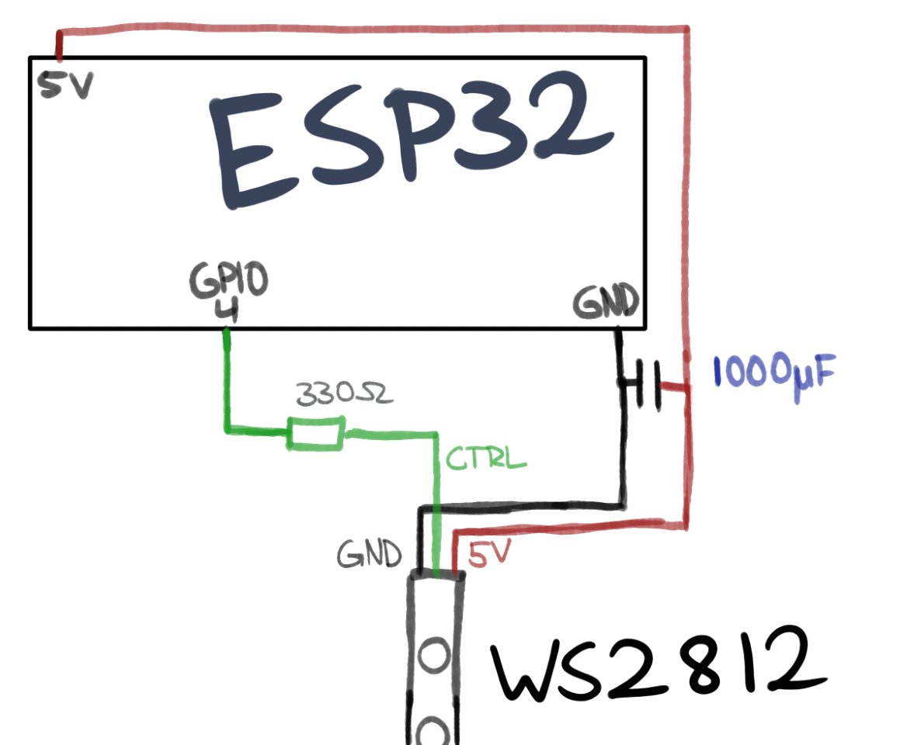

# Central Documentation

## Technical overview

The central application for this LED system has the following tasks:
 - Providing a user interface for managing the connected LED Devices
 - Act as a access point for LED Devices
 - Set modes, colors,.. of connected devices

This mainly works by relying on three handlers:
 - LED_Manager:
   - Holds all connected LED devices
   - Sends commands to devices
   - Provides information about connected devices
 - UDP_handler:
   - Handles incoming messages from the devices (e.g. connection requests)
   - Informs LED_Manager about new devices and queries the adding/welcoming of new devices
 - WebsiteHandler:
   - Manages the user interface, aka a website that runs on the central
   - Creates new commands when the user issues one, these are sent to the LED_Manager command queue

The `loop()` in main.cpp periodically tells the LED_Manager and UDP_handler to handle any packets that arrived since the last update.

## Building

The basic building process is simple: Open the project in PlatformIO and build it as usual.

Some things to note: 
 - If you want to connect the central to your local network, set the `wifi_network_ssid` and `wifi_network_password` accordingly.
 - If you want to test peripheral and central devices at the same time we advice you to set the upload and monitor ports in the `platformio.ini`

## Commands
Commands are UDP messages and can have varying lengths.
Currently, there are five command operators:
 - CHANGE_MODE ('1')
   - Tells the LED device to change it's current mode
 - CHANGE_COLOR ('2')
   - Tels the LED device to change it's 3 main colors
 - TURN_OFF ('3')
   - Tells the LED device to turn off
 - TOGGLE_SYNC ('4')
   - Tells the LED device to sync (or not sync) to broadcast (which means: if not synced, device will only listen to most commands if they are unicasted to them)
 - WELCOME ('5')
   - Can have two meanings: If a welcome message reaches the central, it is a message from a LED device that wants to connect to the central. That message contains all relevant data of that device. If the welcome message stems from the central, it only contains the operator and serves as an ACK.

### Message structures
Messages are structured depending on their types.

#### CHANGE_MODE
This changes the mode AND the colours of the device
| # number of bytes | Description      |
|-------------------|------------------|
| 1                 | Message operator, '1' for changing mode |
| 1                 | The mode identifier |
| 9                 | Values for the 3 colors the device shall use as main colors (3x3byte) |

This changes ONLY the mode of the device
| # number of bytes | Description      |
|-------------------|------------------|
| 1                 | Message operator, '1' for changing mode |
| 1                 | The mode identifier |

#### CHANGE_COLOR
| # number of bytes | Description      |
|-------------------|------------------|
| 1                 | Message operator, '2' for changing color |
| 9                 | Values for the 3 colors the device shall use as main colors (3x3byte) |

#### TURN_OFF
| # number of bytes | Description      |
|-------------------|------------------|
| 1                 | Message operator, '3' for turning the device off |

#### TOGGLE_SYNC
| # number of bytes | Description      |
|-------------------|------------------|
| 1                 | Message operator, '4' for toggling sync |

#### WELCOME
The first message a new devices sends to the central. It contains information on how the device works.
Structure for messages coming **from** an LED device: 
  
| # number of bytes | Description      |
|-------------------|------------------|
| 1                 | Message operator, '5' for welcome messages |
| 1-20              | Supported Device modes (terminated by an X character) |
| 2                 | Number of LEDs, most important 8 bits first |
| 1                 | Current mode this device is in |
| 9                 | Current colors |

Structure for messages being sent **to** an LED device:

| # number of bytes | Description      |
|-------------------|------------------|
| 1                 | Message operator, '5' for welcome msg ACK |

# LED Peripheral Documentation

## Building

### Physical hardware setup
While you can build your own circuits, this is what we were using.

Parts:
 - ESP32
 - WS2812 LED strip
 - 1x 1000µF capacitor
 - 330Ω resistor

### Software

For building the binary file, you can use PlatformIO. If you want to change the hardware, for example when you want to use different LED strips, you can change the `LED_TYPE` in `src/LED_State.h`.

Note: When uploading the binary, you have to long press the ESP32 boot button, and press the EN(able) button once while holding the boot button. Tho sometimes you don't have to press them, I haven't found out yet why that is.

## Technical overview

These LED peripherals are made to be as simple as possible - we have one helper class for parsing and creating messages, one class that controls the state of the led's, and the main file that contains the setup function and the loop that gets called periodically by rtOS.

The `LED_State` controls the current state of the LEDs. It also contains functions for the modes, modes are functions that directly control the colors of the LEDs. For adding a mode one must
 - Add a mode function to the `LED_State`
 - Add the mode to the enum `MODE`
 - Add it to the `supported_modes` vector (this is used for telling the central about what kind of modes this device has)
 - Add the mode to the central so it knows about it

By calling the `update()` function of the LED_State the mode function of the currently selected mode will be called and the LEDs will be updated.

The `LED_State` also holds two rather important booleans:
 - `synced`
   - Per default, all devices set their modes/colors/.. according to broadcasts from the central device. But if synced is false, this device only listens to unicasts. This is useful when you want to control LED strips independently.
 - `connected`
   - This is false as long as we didn't establish a connection to the central. A connection is established by sending a welcome message to the central, and receiving a welcome message back from the central as a unicast.
   - We are sending a welcome message every 3 seconds if we are connected to a WiFi, but not connected to the central host. (see: `check_reconnect` in `main.cpp`)

The `loop()` in `main.cpp` periodically checks for new udp packets to be parsed, checks if we are still connected, and then updates the LEDs.